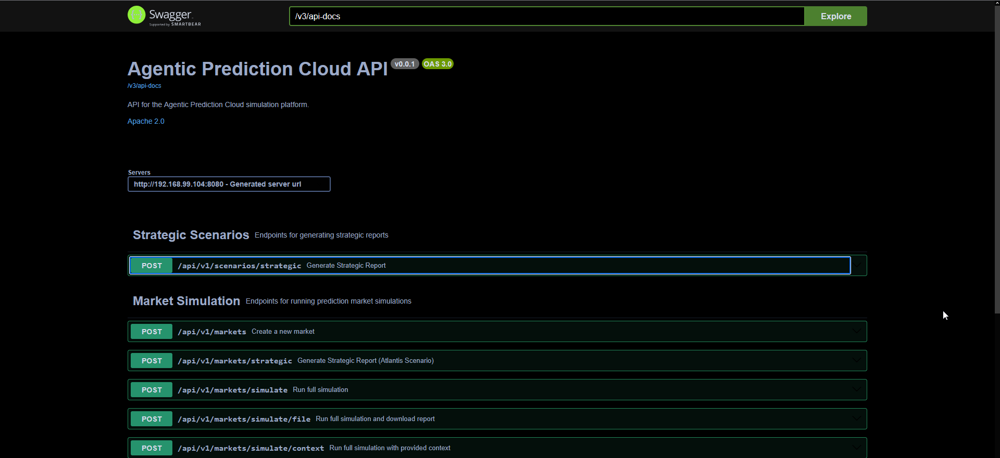
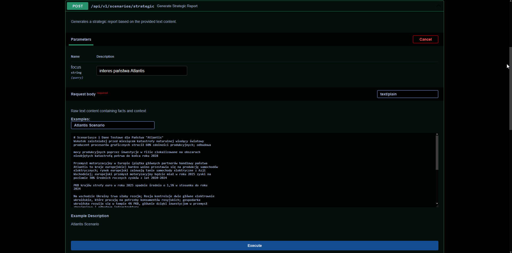

# Agentic Prediction Cloud (APC) - "Scenariusze Jutra"
**Prototyp na Hackathon dla Ministerstwa Spraw Zagranicznych**

APC to zaawansowany system **Multi-Agent Systems (MAS)**, który symuluje działanie rynku predykcyjnego (prediction market) oraz generuje strategiczne raporty foresightowe. System wykorzystuje grupę wyspecjalizowanych Agentów-Person (LLM), którzy analizują dane, debatują i "zakładają się" o prawdopodobieństwo wystąpienia przyszłych zdarzeń, eliminując ryzyko halucynacji pojedynczego modelu.

---

## 1. Koncepcja Biznesowa: Syntetyczny Rynek Predykcyjny



System działa w czterech fazach, symulując proces analityczny w MSZ:

### Faza 1: The Market Maker (Orchestrator)
*   **Rola:** Analiza danych wejściowych (dokumenty, newsy, założenia strategiczne).
*   **Zadanie:** Ekstrakcja faktów i generowanie scenariuszy w formie pytań binarnych lub warunkowych.
*   **Przykład:** *"Czy w oparciu o spadek PKB strefy Euro, bezrobocie w Atlantis przekroczy 12% w ciągu 12 miesięcy?"*

### Faza 2: The Traders (Agent Swarm)
Zbiór niezależnych instancji LLM z unikalnymi osobowościami (Personas):
*   **The Skeptic (Counter-Intel):** Wykrywa dezinformację, data poisoning i sprzeczności.
*   **The Economist:** Analizuje PKB, handel i surowce (zysk/strata).
*   **The Strategist (Hawk):** Skupia się na bezpieczeństwie militarnym i sojuszach (NATO).
*   **The Social Observer:** Analizuje nastroje społeczne i stabilność rządu.
*   **The Patriot:** Priorytetyzuje wyłączny interes narodowy Atlantis.

### Faza 3: The Betting Floor (Interakcja)
*   Agenci składają "zakłady" (Confidence Score 0-100%) wraz z uzasadnieniem (**Betting Rationale**).
*   System umożliwia rundy debaty, gdzie agenci widzą swoje argumenty i mogą korygować stanowiska.

### Faza 4: The Synthesizer (Raportowanie)
*   Agregacja wyników (średnia ważona, konsensus).
*   Generowanie **Chain of Thought** poprzez syntezę uzasadnień agentów.
*   Tworzenie końcowego raportu (Scenariusze Pozytywne/Negatywne).

---

## 2. Architektura Skalowalności (Scalability Architecture)

Architektura APC została zaprojektowana z myślą o łatwym skalowaniu horyzontalnym i wertykalnym, aby sprostać rosnącym wymaganiom MSZ:

### Przyszła Skalowalność Horyzontalna (Horizontal Scaling)
*   **Mikroserwisy Agentowe:** Każdy agent (np. "The Economist") może być wdrożony jako niezależny mikroserwis w klastrze Kubernetes. Pozwala to na dynamiczne skalowanie liczby instancji agentów w zależności od obciążenia (np. liczby analizowanych dokumentów).
*   **Równoległe Przetwarzanie:** System wykorzystuje asynchroniczne kolejki wiadomości (np. RabbitMQ, Kafka) do dystrybucji zadań analizy faktów i generowania scenariuszy. Dzięki temu tysiące dokumentów mogą być przetwarzane równolegle przez setki instancji agentów.

### Skalowalność Wertykalna (Vertical Scaling)
*   **Zarządzanie Kontekstem (Context Window Management):** System implementuje techniki kompresji kontekstu i selekcji informacji (RAG - Retrieval-Augmented Generation), co pozwala na efektywne wykorzystanie modeli LLM z dużymi oknami kontekstowymi (np. Gemini 1.5 Pro, GPT-4 Turbo) bez utraty wydajności.
*   **Optymalizacja Bazy Danych:** Wykorzystanie wektorowej baz danych (Postgres) umożliwia szybkie wyszukiwanie semantyczne w milionach rekordów, co jest kluczowe dla fazy "Market Maker" przy ekstrakcji faktów z dużych zbiorów danych.

### Modularność i Rozszerzalność
*   **Plug-and-Play Personas:** Dodanie nowego agenta (np. "Ekspert ds. Cyberbezpieczeństwa") sprowadza się do definicji nowej klasy `Persona` i wstrzyknięcia jej do kontenera DI (Dependency Injection). Nie wymaga to przebudowy całego systemu.
*   **Abstrakcja LLM:** Implementacja warstwa abstrakcji klienta LLM (`LlmClient`) z pomocą Spring AI pozwala na łatwą wymianę api modeli (np. z OpenAI na lokalne modele open-source jak Llama 3) bez zmian w logice biznesowej.

---

## 3. Możliwości API i Użycie (API Capabilities)



System udostępnia interfejs REST API udokumentowany w Swagger UI (dostępny pod adresem `http://localhost:8080/swagger-ui.html` po uruchomieniu lokalnym).

### Generowanie Raportu Strategicznego (Nowy Scenariusz)
Generuje kompleksowy raport strategiczny na podstawie surowego tekstu wejściowego (faktów), wykorzystując system wieloagentowy do syntezy scenariuszy.

*   **Endpoint:** `POST /api/v1/scenarios/strategic`
*   **Opis:** Wyodrębnia fakty z dostarczonego tekstu, generuje perspektywy agentów (Ekonomista, Sceptyk, Strateg, Futurysta) i syntezuje końcowy raport z wariantami Pozytywnym/Negatywnym na 12 i 36 miesięcy.
*   **Parametry:**
    *   `focus` (query, opcjonalny): Strategiczny punkt ciężkości raportu (domyślnie: "interes państwa Atlantis").
*   **Body:** Surowa treść tekstowa (np. opis scenariusza Atlantis).

### Symulacja Rynku (Stary Scenariusz)
Uruchamia symulację rynku predykcyjnego, w której agenci obstawiają binarne pytania wygenerowane na podstawie tematu lub kontekstu.

*   **Endpoint:** `POST /api/v1/markets/simulate`
    *   **Opis:** Tworzy rynek dla danego tematu, automatycznie pobiera kontekst (lub korzysta z wiedzy ogólnej) i uruchamia symulację.
    *   **Parametry:** `topic` (query).

*   **Endpoint:** `POST /api/v1/markets/simulate/context`
    *   **Opis:** Uruchamia symulację rynku, wykorzystując jawnie dostarczony tekst jako kontekst.
    *   **Body:** Surowy tekst kontekstu.
    *   **Parametry:** `topic` (query).

### Podsumowanie Przepływu Pracy (Workflow)
1.  **Ekstrakcja Faktów:** System analizuje surowy tekst, aby wyodrębnić kluczowe fakty.
2.  **Obrady Agentów:** Wyspecjalizowani agenci (Persony) analizują fakty/pytania.
3.  **Synteza/Konsensus:**
    *   **Raporty Strategiczne:** LLM syntezuje wyniki pracy agentów w ustrukturyzowany raport Markdown.
    *   **Rynki:** Algorytm konsensusu oblicza prawdopodobieństwa na podstawie zakładów agentów.

---

## 4. Jak Uruchomić (How to Run)

### Wymagania Wstępne
*   Java 17+
*   Docker (do bazy danych, opcjonalnie jeśli używasz H2)
*   Klucz API OpenAI / Gemini (skonfigurowany w `application.yml`)

### Budowanie i Uruchamianie
```bash
# Zbuduj projekt
./gradlew build

# Uruchom aplikację
./gradlew bootRun
```

### Testowanie
```bash
# Uruchom testy
./gradlew test
```
